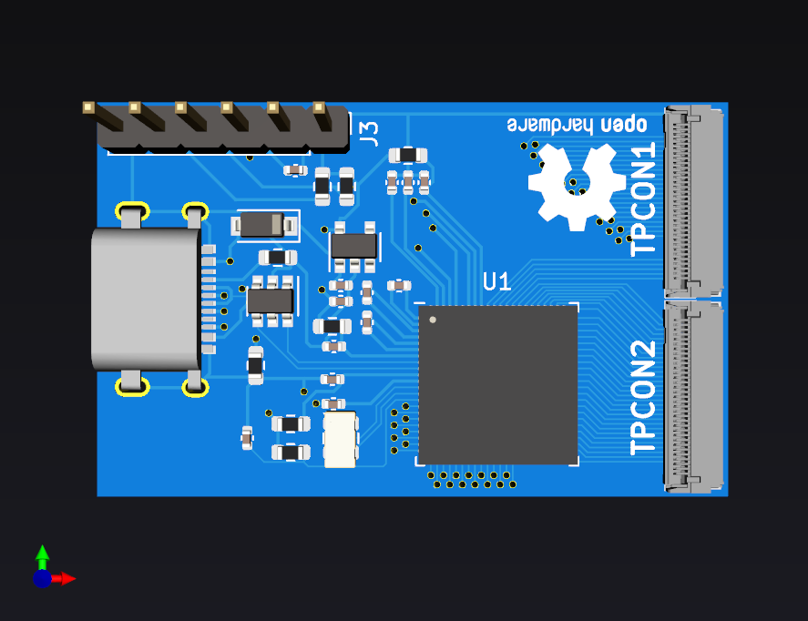

# ILI2511-N7

Nexus 7(2nd gen) touch controller board based on Ilitek 2511 (only USB and I2C is supported)

## Revisions

 * v1 is currently in testing stage (waiting board to arrive so can test it)
 will update progress here later on

## Licence

 * Hardware in this repository is licenced under CERN OHL v1.2
